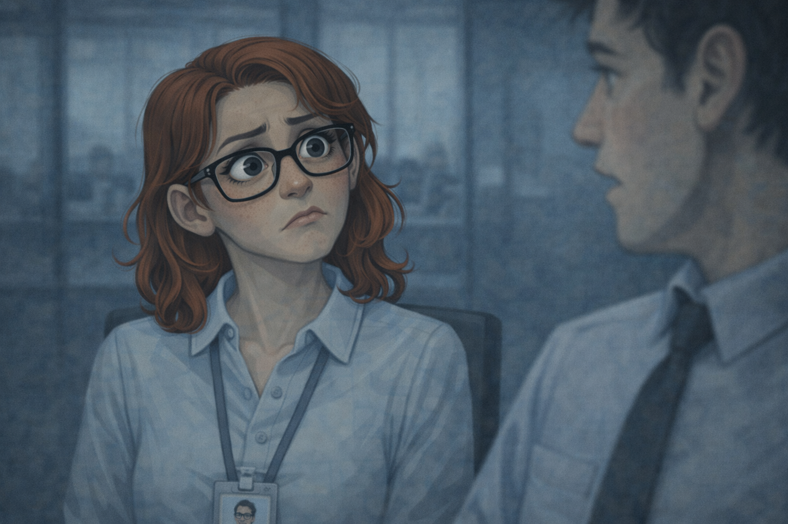
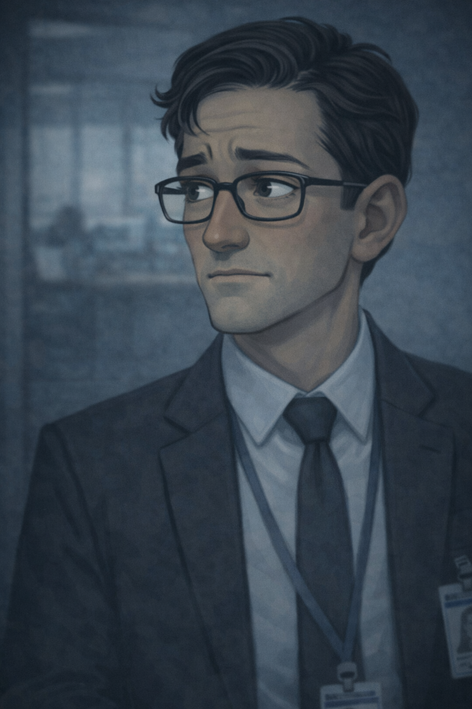

## 🕯 Issue #3  

## What Is an Insider Threat?

> *“Most insider threats don’t start with theft.  
They start with trust — and the slow erosion of it.”*

---

## Act I — The Trusted One

The operations floor is calm.

Monitors glow white.  
Keyboards click.  
People work without urgency.



This is what a secure workplace looks like when nothing is wrong.

## Character Lock-in
**Name:** Elias Ward  
**Role:** Security Analyst / Observer  

Reliable.  
Consistent.  
Unremarkable.




Elias Ward stands behind the glass partition.

His job isn’t to watch people closely.  
It’s to notice when behavior slowly stops matching expectations.

Timing.  
Access.  
Patterns.

In his head:

> *“If something becomes a problem,  
it usually looks normal at first.”*

### **Character Lock-In**

**Name:** Daniel Cole  
**Role:** Trusted Employee / Insider Threat 

Daniel Cole sits a few rows away.

He’s been here for years.  
People rely on him.




Coworkers chat quietly and move with ease.

Daniel appears comfortable and integrated within the group.

This is normal.  
Sharing work between trusted teammates is expected.





Badges beep.  
Doors unlock.  
People move freely.

Everyone here has access because they’re supposed to.



Access granted.

Daniel is authorized to be there.  
The timing is normal.  
The activity matches his role.

Elias doesn’t flag it.

There’s nothing unusual yet.

---

## Act II — The Review

Later that week, Daniel is called into a meeting.



Nothing urgent.  
Nothing alarming.

Just routine.

### **Character Lock-In**

**Name:** Marianne Holt  
**Role:** Manager / Authority Figure

Policy-driven.  
Professional to the core.

She documents performance.  
She doesn’t track fallout.


Marianne Holt sits across from him.




She slides a document forward.

**Marianne:**  
“This is your quarterly review.”

She points to a section.

**Marianne:**  
“A few deliverables missed their targets.  
We need improvement next cycle.”

Daniel listens carefully.


In his head:

> *“I stayed late.  
I fixed problems no one else touched.”*



He keeps his voice even.

**Daniel:**  
“Okay. I understand.”

The meeting ends politely.




The message lingers.

Daniel walks past Elias.

His pace is faster than usual.  
His shoulders are tense.

Elias notices the shift.


In his head:

> *"That’s new."*




Not a violation.  
Just a change.

---

## Act III — Friction

At the next team meeting, a slide appears on the screen.

**Elias:**  
"Starting Monday, cross-team access will require approval."



Daniel speaks before anyone else.

**Daniel:**  
"So now we need permission just to do our jobs?"




The room goes quiet.

**Elias:**  
“It’s a security requirement.”

**Daniel:**  
“It feels excessive.”

A few people glance at each other.

 


No one agrees.  
No one pushes back.

The moment passes — but it’s remembered.

Later, in the hallway:

**Daniel:**  
“They keep adding rules because they don’t trust us.”




**Coworker:**  
“I think it’s just policy.”

Daniel exhales sharply and walks off.



### That night, most of the office is dark.

One desk is still lit.



Elias reviews system activity.

03:12 AM.  
04:47 AM.


Daniel’s account appears again — after midnight.

Once could be overtime.  
Twice could be coincidence.

Repeated late access becomes a pattern.


In his head:

> *“Still authorized.  
But no longer expected.”*




---

## Act IV — Curiosity

Break room.

Daniel pours coffee next to **Jordan Reyes** {Support Engineer}.



**Daniel:**  
“Hey — quick question.”

**Daniel:**  
“How does your team handle credential resets?”



Jordan hesitates.



**Jordan:**  
“Why do you need to know?”



**Daniel:**  
“I don’t. Just curious.”

Jordan feeling uneasy gives a short, careful answer.


Enough to be polite.  
Not enough to be useful.

The pause says more than the words.



Elias watches from across the room.

In his head:

> *“That system isn’t part of Daniel’s responsibilities, niether was that a needed question.”*




---

## Act V — Pressure

At lunch, Daniel jokes about money.

**Daniel:**  
“Feels like everything costs more lately.”

A few people nod.  
The topic changes.



A few days later, Elias notices something else.

A new car in the parking lot.  
Expensive.



Daniel doesn’t mention it.

---

## Act VI — The Choice


Back at the office, Elias reviews everything together with his lead.



```
Behavior changes.  
Repeated policy resistance.  
After-hours access patterns.  
Questions outside role.  
Complains about how expensive everything is, yet bought a new car.
```



None of it proves malicious intent.

All of it signals risk.

**Elias:**  
“I don’t think he’s trying to hurt the company.”



Pause.

**Elias:**  
“But he’s becoming vulnerable.”



They sit with the decision.

Intervene now — or wait for proof. <section class="scenario-interlude">
  <div class="scenario-header">
    Decision Point
  </div>

  <p class="scenario-context">
    Elias has seen enough to be concerned — but not enough to accuse.
    Acting too late risks damage.
    Acting too early risks trust.
  </p>

  <p class="scenario-question">
    What should the defender do?
  </p>

  <div class="scenario-actions">
    <button onclick="showOutcome('intervene')">Intervene now</button>
    <button onclick="showOutcome('wait')">Wait for proof</button>
  </div>

  <div id="intervene" class="scenario-outcome">
    <strong>Intervene now 🟩</strong>
    <p>
      Security reaches out early.  
      Support resources are offered.  
      Access is reviewed quietly.
    </p>
    <p>
      The situation stabilizes.  
      No breach occurs.
    </p>
  </div>

  <div id="wait" class="scenario-outcome">
    <strong>Wait for proof 🟥</strong>
    <p>
      Pressure continues unchecked.  
      External influence deepens.
    </p>
    <p>
      The next alert isn’t a warning.  
      It’s an incident.
    </p>
  </div>
</section>

<style>
  /* OUTER DECISION CONTAINER — MORE FADED */
  .scenario-interlude {
    margin: 3rem 0;
    padding: 2.25rem;
    background: #2a2a2a;          /* lighter, faded charcoal */
    border: 1px solid #3f3f3f;
    border-radius: 12px;
    font-size: 1em;
  }

  .scenario-header {
    font-size: 1em;
    font-weight: 700;
    letter-spacing: 0.10em;
    text-transform: uppercase;
    color: #e5e7eb;
    margin-bottom: 1.25rem;
    padding-bottom: 0.9rem;
    border-bottom: 1px solid #3f3f3f;
  }

  .scenario-context {
    font-size: 1em;
    color: #f1f5f9;
    line-height: 1.75;
    margin-bottom: 1.5rem;
  }

  .scenario-question {
    font-size: 1.15em;
    font-weight: 700;
    color: #ffffff;
    margin-bottom: 1.25rem;
  }

  /* BUTTONS — SAME COLOR AS OUTCOME BOX */
  .scenario-actions button {
    font-size: 1em;
    padding: 0.7rem 1.4rem;
    border-radius: 10px;
    border: 1px solid #4a4a4a;
    background: #1f1f1f;          /* darker than outer, not pitch */
    color: #ffffff;
    cursor: pointer;
  }

  .scenario-actions button:hover {
    background: #252525;
  }

  /* OUTCOME BOX — SAME COLOR AS BUTTONS */
  .scenario-outcome {
    display: none;
    margin-top: 1.75rem;
    padding: 1.75rem 2rem;
    background: #1f1f1f;          /* matches buttons */
    border: 1px solid #444;
    border-radius: 12px;
    font-size: 1em;
    color: #e5e7eb;
    line-height: 1.75;
  }

  .scenario-outcome strong {
    display: block;
    font-size: 1.1em;
    font-weight: 800;
    margin-bottom: 0.75rem;
    color: #ffffff;
  }
</style>


<script>
  function showOutcome(choice) {
    document.getElementById('intervene').style.display = 'none';
    document.getElementById('wait').style.display = 'none';
    document.getElementById(choice).style.display = 'block';
  }
</script>



No breach happens that night.

But the warning signs are no longer subtle.

---

## 🛡 Defender’s Lens

Nothing illegal happened.  
No data was stolen.  
No credentials were shared.

And yet, every insider threat indicator appeared — one by one.

Insider threats are rarely criminals first.  
They are trusted people under pressure.

The defender’s role is not just to stop attacks,  
but to recognize when intervention can prevent one.

---

## Final Caption

> *“Insider threat indicators are not proof.  
They are warnings — meant to be acted on.”*

---

## 🕯 End of Issue #3  

**Next:**  
*The outsider who doesn’t need access —  
because they know how to ask.*
